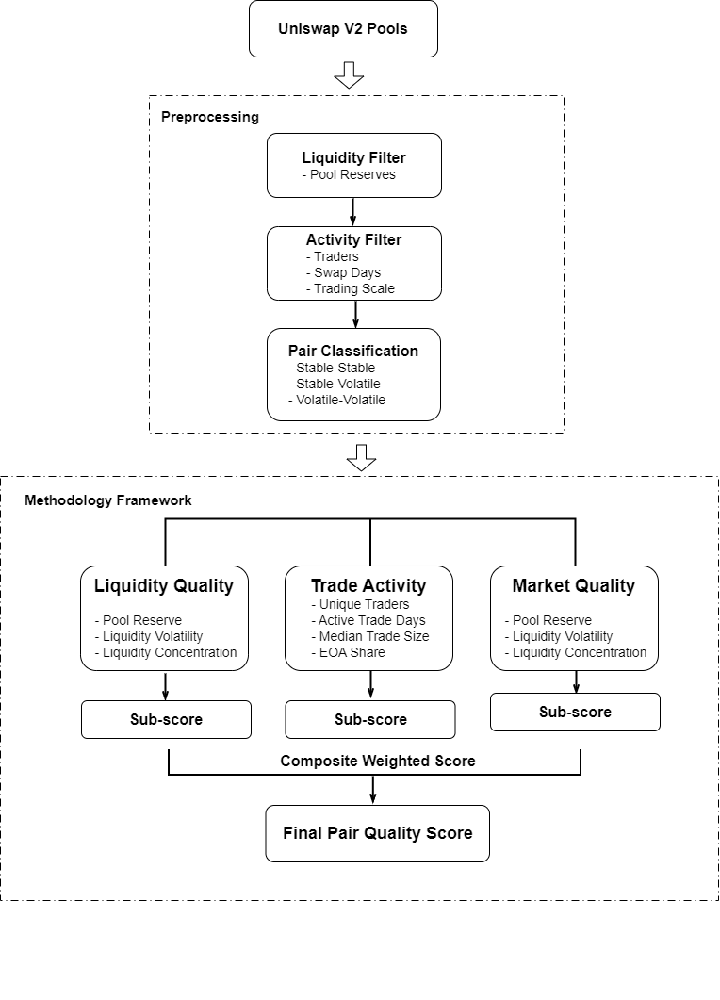

# On-Chain Trading Data: DEX Liquidty Quality Analysis

**Authour**: Jing Jiang Santiana_ia

**Date**: 11/2025 - 02/2026

**Data Source**: On-chain trading data from Uniswap V2

**Tools**: Dune Analytics, SQL

**Link of Dashboard**: [link](https://dune.com/santiana_ia/pjjjj)

**Link of Code**: [link](https://dune.com/workspace/u/santiana_ia/folders/Project:%20DEX_quality_uniswapv2)

 
 

# Research Question 
> Which liquidity pools on Uniswap V2 provide the **highest quality**?

 

# Introduction

This project evaluates **the quality of liquidity pools on Uniswap V2** using on-chain trading data.

**Uniswap V2** allows anyone to create liquidity pools, resulting in thousands of trading pairs with highly uneven liquidity, activity, and trader participation. Many pools are inactive, illiquid, or dominated by automated trading.

 

To identify economically meaningful pools, this analysis ranks pairs across **three dimensions**:

- **Liquidity Capacity**
- **Trade Activity**
- **Market Quality**

The goal is to highlight pools that provide stable liquidity, active trading, and efficient price discovery.
 

 

# **Methodology**

## 1. Analytical Framework

This project proposes a **multi-dimensional framework** to systematically evaluate the quality of trading pairs on Uniswap V2.

Rather than relying on a single metric such as trading volume or liquidity size, the analysis evaluates pools across three complementary dimensions that reflect different aspects of market performance:

1. **Liquidity Quality** — whether a pool provides sufficient and stable liquidity depth

2. **Trade Activity** — whether the pool is consistently used by diverse participants

3. **Market Quality** — whether trades can be executed efficiently with prices aligned to the broader market

Each dimension captures a different characteristic of a healthy trading market. Together, by condensing score for each dimension, they provide a more comprehensive view of pool quality.

 

<h4 align="center">Methodology Framework</h4>

  

 
 

## 2. Detailed Methodology
### 2.1 Stage 1: Data Preprocessing

Pool-level metrics are computed using on-chain swap and liquidity data over the past 7 days. Detailed processing is as below.

**(1) Liquidity Filter**

Uniswap V2 contains 2000+ trading pairs. A substantial proportion of these pools are illiquid, inactive or concentrated among a small number of participants.
The objective of this stage is to remove non-viable pools to ensure effective analysis.

  - **Metric:** `avg_reserve_usd_7d (average reserve usd within last 7 days)`

  - **Rule:** `Exclude pools below 90th percentile of average liquidity within 7 days. (Percent rank ≥ 90th percentile)`

**(2) Pair Classification**

Price behavior in AMMs depends heavily on underlying asset volatility. So that we can conduct Within-group comparisons to offer more meaningful analysis.

Here we classified pairs based on token characteristics:

- Stable–Stable
- Stable–Volatile
- Volatile–Volatile

 
 

### 2.2 Stage 2: Metric Construction in Each Dimension

For each dimension, several metrics are designed to capture key characteristics of corresponding dimension. 
Each metric reflects a specific aspect of pool performance.
Then, they are normalized into comparable scores ranging from 0 to 1, and combined with weights in each dimension. Higher scores indicate better performance.

#### **(1) Dimension 1: Liquidity Quality**

**Goal:** Liquidity Quality dimension is to measure how much liquidity exists and how reliable it is. 

**Metrics used:**

- **Liquidity Depth:** `avg_reserve_usd_7d` 
- **Liquidity Stability:** `liquidity_stability_score`
              
        - liquidity_volatility_7d = stddev(liquidity_7d) / mean(liquidity_7d)
        - normalize liquidity_volatility_7d into liquidity_volatility_score in the range [0,1]
        - liquidity_stability_score = 1 - liquidity_volatility_score 

- **Liquidity Distribution:** `liquidity_distribution_score`
              
        - lp_gini = SUM((2 * rank - num_holders - 1) * balance_rank) / (num_holders * SUM(balance))
        - normalize lp_gini into the range of [0,1]
        - liquidity_concentration_score = 0.6 * lp_gini + 0.4 * top1_share
        - liquidity_distribution_score = 1 - liquidity_concentration_score

**Weights assigned:**
    
- Liquidity Depth Score: 0.5
- Liquidity Stability Score: 0.3
- Liquidity Distribution Score: 0.2

All metrics are normalized to a 0-1 score, then aggregated with weights into a dimension score for each pool.

 

#### **(2) Dimension 2: Trade Activity**

**Goal:** To measure whether a pool exhibits consistent, diversified, and economically meaningful trading behavior, rather than activity concentrated in automated or arbitrage patterns. 

**Metrics used:**

 - **Consistency of Usage**: `swap_days_7d` 

 - **Participation Breadth**: `unique_traders_7d` 

 - **Economic Depth**: `median_daily_volume_7d`

 - **Organic Participation (EOA Share)**: `eoa_like_traders_share`, `eoa_like_volumes_share`

       - eoa_like_traders_share = eoa_like_traders / all_traders
       - eoa_like_volumes_share = eoa_like_volumes / total_volumes

**Weights assigned:**

- Usage Consistency Score: 0.25
- Participation Breadth Score: 0.35
- Economic Depth Score: 0.3
- Organic Participation Score: 0.15

All metrics are normalized to a 0-1 score, then aggregated with weights into a dimension score for each pool.

 

#### **(3) Dimension 3: Market Quality**

**Goal:** To evaluate whether trades in a pool can be executed efficiently and at prices close to the broader market. 

**Metrics used:**

- **Price Impact:** `median_sim_price_impact_7d`
- **Price Efficiency:** `median_price_deviation_7d` 

**Weights assigned:**
 
- Price Impact Score: 0.7
- Price Efficiency Score: 0.3

All metrics are normalized to a 0-1 score, then aggregated with weights into a dimension score for each pool.

 
 

### 2.3 Stage 3: Dimension Scoring and Ranking
So far, we've got the 0-1 score for each dimension, then we aggregated them into an overall pool score and pool rank.

 
 

### **Key Results**

Key Findings

Visual Analysis

 

### **Limitations**

Several limitations should be considered:

Price deviation depends on the quality of the reference price source.

EOA classification approximates organic activity but cannot perfectly separate human users from automated wallets.

The analysis focuses on 7-day metrics, which may not capture longer-term market dynamics.

